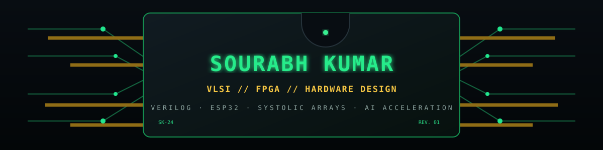
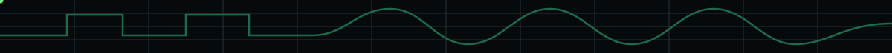

<p align="center">
  
</p>

<p align="center">
  <a href="https://github.com/skumar3be24-ux"></a>
  
</p>

<p align="center"><strong>VLSI &amp; hardware design student</strong><br/>Verilog · FPGA (Vivado) · ESP32 · Systolic arrays · AI acceleration</p>

<p align="center"></p>

<p align="center"></p>

```text
FOCUS       VLSI design · digital hardware · AI acceleration
BUILDING    FPGA systems · ESP32 projects · RTL designs
EXPLORING   Systolic arrays · computer vision · embedded systems
TOOLKIT     Verilog · SystemVerilog · VHDL · Vivado · Python · C++
```

<p align="center"></p>

<p align="center">
  
  
  
  
  
  
  
  
  
</p>

<p align="center"></p>

<p align="center"></p>

| Project | What it does | Stack |
|:--|:--|:--|
| [FFT Radar 3D Engine](https://github.com/skumar3be24-ux/fft-radar-3d-engine) | 3D FMCW MIMO radar Range → Doppler → Angle RTL pipeline for the KC705 | SystemVerilog |
| [CAN eSIM](https://github.com/skumar3be24-ux/can-esim) | Circuit-level mixed-signal CAN controller and physical-layer verification in eSim/ngspice | VHDL |
| [ESP32 Wireless Buggy](https://github.com/skumar3be24-ux/esp32-wireless-buggy-control) | Browser-based wireless control with live speed adjustment | C++ · ESP32 · WebSockets |
| [Hand Gesture Recognition](https://github.com/skumar3be24-ux/hand-gesture-recognition) | Real-time hand gesture recognition using a webcam | Python · OpenCV · MediaPipe |

<p align="center"></p>

<p align="center"></p>

<p align="center">
  <a href="https://github.com/skumar3be24-ux"></a>
  <a href="https://www.linkedin.com/in/sourabh-kumar-739bbb309"></a>
</p>

<p align="center"><sub>Designing hardware one signal at a time.</sub></p>
